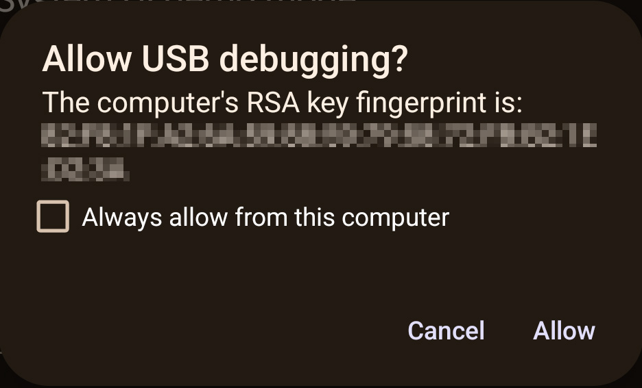
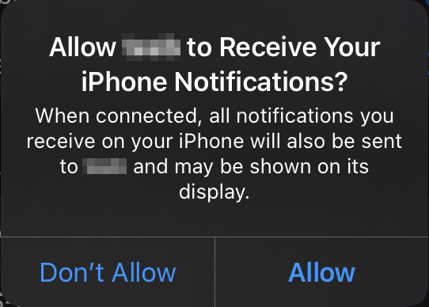

as a user...
====================

User How-To's for PILOT Drive

Add new themes
----------------------

This how-to assumes PILOT Drive has been installed, and a settings file was created.

#. In your favorite text editor, open the ``settings.json`` (default path is ``/etc/pilot-drive/config/settings.json``)
#. Once in the settings file, navigate to the ``webSettings`` → ``themes`` section
#. Add the desired theme in the `below format`_, adding a name for the theme along with a primary, secondary, and accent color in an integer RGB format. `color-hex <https://www.color-hex.com/color-palettes/>`_ has some cool user made palettes.
#. Save ``settings.json`` and restart PILOT Drive
#. Once restarted, in the UI navigate to the settings tab and your new theme should be there!

.. _below format:
.. code-block:: json
    :caption: Theme format (note: each array of zeros should be replaced with [red int, green int, blue int])

    {
        "name": "<name>",
        "accent": [
            0,
            0,
            0
        ],
        "primary": [
            0,
            0,
            0
        ],
        "secondary": [
            0,
            0,
            0
        ]
    }

Recieve notifications from my Android device
--------------------------------------------

| PILOT Drive pulls Android notifications over USB via ADB. 
|
| **While wireless ADB might be implemented in the future, right now a physical USB connection is required.**

#. If Android notifications weren't enabled & installed with the PILOT Drive installer:
    #. Quick Install:

    .. code-block:: sh
        
        python3.11 -m pilot_drive --setup --phone=android

    #. Manual Install: 
        #. Install ADB on the PILOT Drive host machine
        #. Pull AAPT2 for the host machine's architecture in the `PILOT Drive bin directory <https://github.com/lamemakes/pilot-drive/tree/master/bin/aapt2>`_
        #. Copy AAPT2 to ``/usr/local/bin/aapt2`` and make it executable ``chmod +x /usr/local/bin/aapt2``
        #. Open PILOT Drive ``settings.json`` (default path is |settings_path|)
        #. Under ``"phone"`` ensure ``"enabled": true`` and ``"type": "android"``
        #. Restart PILOT Drive
#. Enable USB debugging on your Android device (paraphrased from `howtogeek's ADB article <https://www.howtogeek.com/125769/how-to-install-and-use-abd-the-android-debug-bridge-utility/>`_):
    #. Open your phone’s app drawer, tap the Settings icon, and select “About Phone”
    #. Scroll all the way down and tap the “Build Number” item seven times. You should get a message saying you are now a developer.
    #. Head back to the main Settings page, and you should see a new option in the “System” section called “Developer Options.”
    #. Once in Developer Options, enable “USB Debugging”
#. Connect your Android device to the PILOT Drive host machine via USB
#. On your Android device, an `"Allow USB debugging?"`_ prompt should appear
#. Select the "Always allow from this computer" check box, and then select "Allow"
#. Under the phone view, any **active** notifications from the connected ADB device will be present.

.. _"Allow USB debugging?":

    Trust ADB host device prompt on Android

Recieve notifications from my iOS device
--------------------------------------------

| PILOT Drive listens for iOS notifications via `ANCS <https://developer.apple.com/library/archive/documentation/CoreBluetooth/Reference/AppleNotificationCenterServiceSpecification/Specification/Specification.html>`_, thus all that's needed to recieve notifications is a bluetooth connection.

#. If iOS notifications weren't enabled & installed with the PILOT Drive installer:
    #. Quick Install:
    
    .. code-block:: sh

        python3.11 -m pilot_drive --setup --phone=ios

    #. Manual Install:
        #. `Install ancs4linux <https://github.com/pzmarzly/ancs4linux#running>`_ on the PILOT Drive host machine
        #. Open PILOT Drive ``settings.json`` (default path is |settings_path|)
        #. Under ``"phone"`` ensure ``"enabled": true`` and ``"type": "ios"``
        #. Restart PILOT Drive
#. If previously connected, forget the host machine on your iOS device and vice versa.
#. Pair your iOS device to the PILOT Drive host machine
#. On your iOS device, a `"Allow <host> to Recieve Your Notifications?"`_ prompt should appear
#. Select "Allow"
#. Under the phone view, any **new** notifications from the connected iOS device will be present

.. _"Allow <host> to Recieve Your Notifications?":

    Trust ANCS host device prompt on iOS

.. _OBDII/ELM327 reader, and specified a path:

Connect my ODBII/ELM327 reader
-------------------------------

Get that juicy data from your vehicle!

#. Connect either your USB *OR* Bluetooth serial device to the host machine.
    - While out of scope for this how-to, both transfer mediums should create a serial port at dev/ttyXXXX, but Bluetooth might require more tinkering with RFCOMM
#. Configure PILOT Drive to work with your connected reader:
    #. Quick install:

    .. code-block:: sh

        python3.11 -m pilot_drive --setup --obd="<path_to_obd>" # Replace with serial port path fromn step 1

    #. Manual install:
        #. Open PILOT Drive ``settings.json`` (default path is |settings_path|)
        #. Under ``"vehicle"`` ensure ``"enabled": true`` and ``"port": "<path_to_obd>"``
#. Restart PILOT Drive

Add a new OBDII/ELM327 stat to query
------------------------------------

This how-to assumes you've already configured your `OBDII/ELM327 reader, and specified a path`_

#. Open PILOT Drive ``settings.json`` (default path is |settings_path|)
#. Under ``"vehicle"``, locate ``"stats"``
#. Each stat object needs to have the following attributes (an `example`_ can be seen below):
    #. ``name``: The name that is displayed in the UI
    #. ``command``: The command used by `python-obd <https://python-obd.readthedocs.io/en/latest/Command%20Tables/>`_ to get the specified data field
    #. ``interval``: Seconds between each query
#. Restart PILOT Drive

**NOTE: Before raising a new issue, confirm your vehicle supports the specified data field!**

.. _example:
.. code-block:: json
    :caption: Vehicle format (note: these are boilerplate stats & intervals, and the port should be replaced)

    "vehicle": {
        "enabled": true,
        "port": "<path_to_obd>",
        "stats": [
            {
             	"name": "Speed",
                "command": "SPEED",
                "interval": 0.5
            },
            {
             	"name": "RPM",
                "command": "RPM",
                "interval": 0.5
            },
            {
             	"name": "Throttle Position",
                "command": "THROTTLE_POS",
                "interval": 3
            },
            {
             	"name": "Voltage",
                "command": "CONTROL_MODULE_VOLTAGE",
                "interval": 3
            }
        ]
    }
